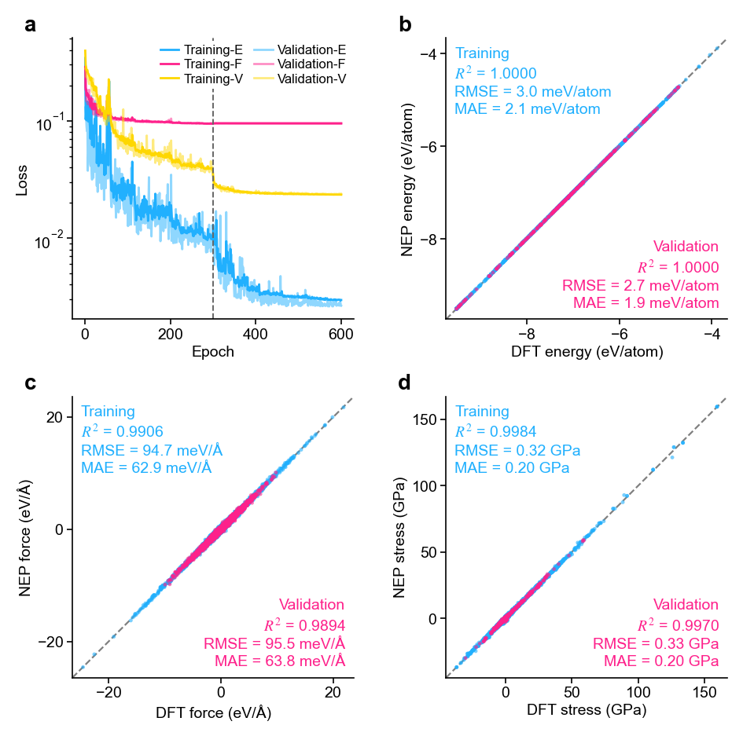
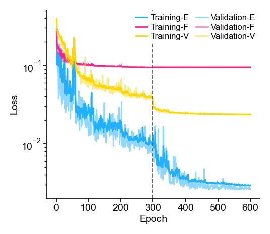
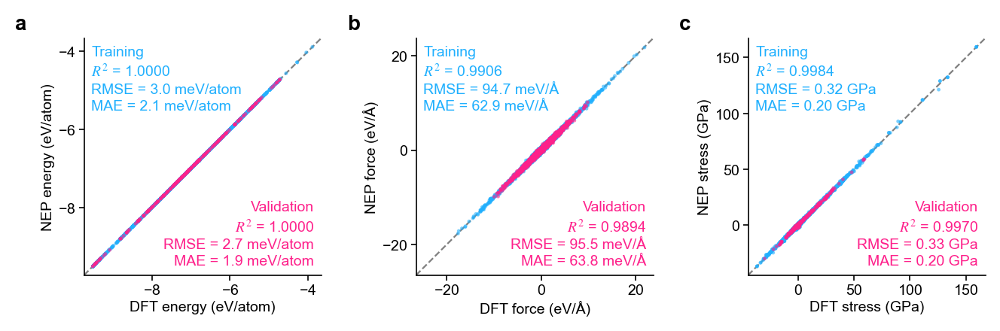
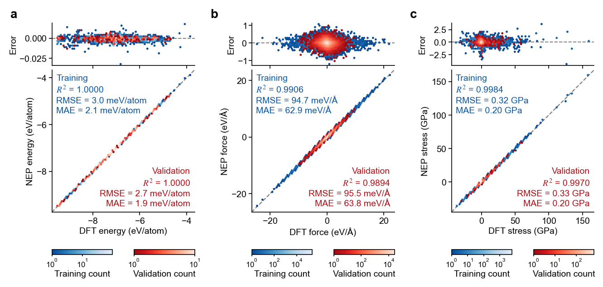
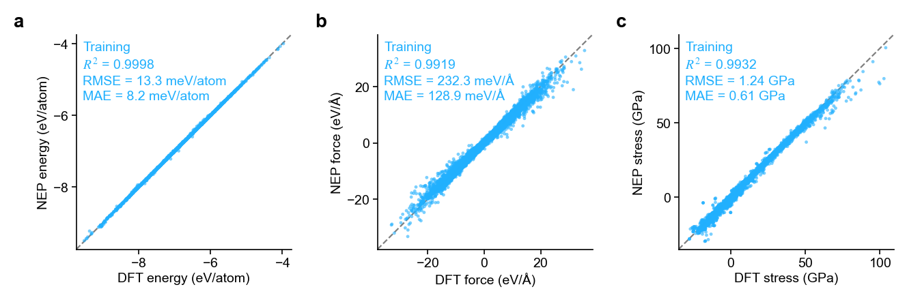
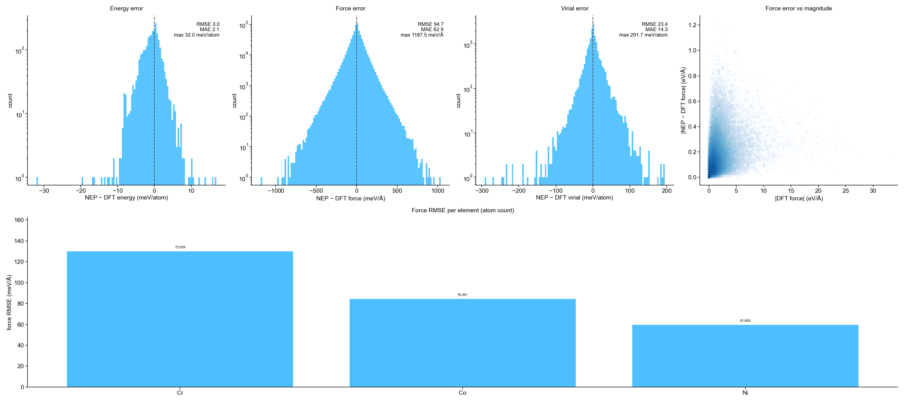
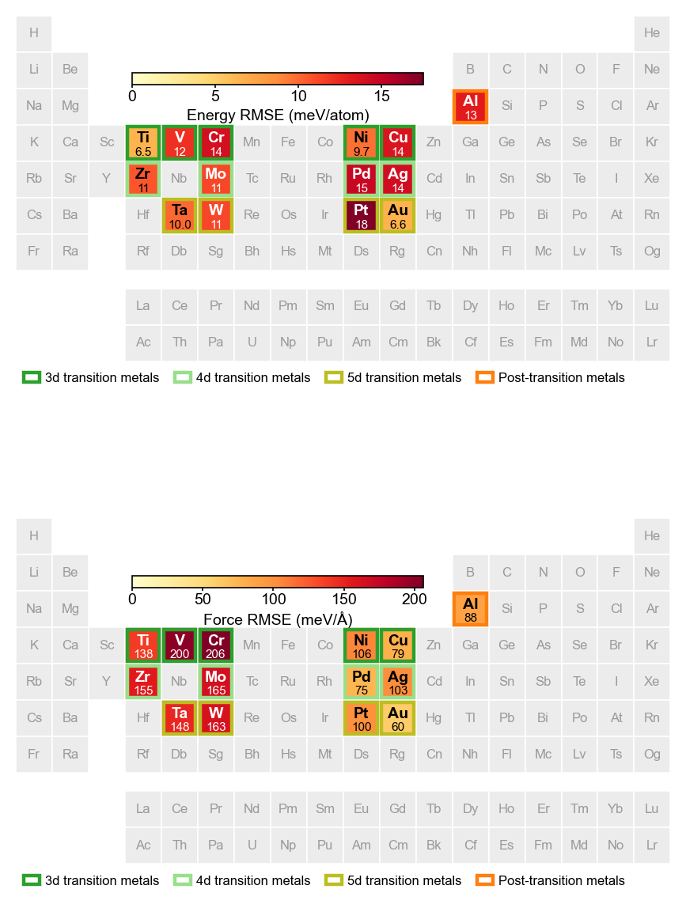

# Plotting

`torchnep.plot.NEPPlotter` draws figures straight from the files a run writes — `loss.out`, `energy/force/virial/stress_train.out` and `*_test.out` — and from the output of `predict_dataset`. It needs matplotlib: `pip install torchnep[plot]`.

```python
from torchnep.plot import NEPPlotter

p = NEPPlotter()
p.dashboard("run", out="dashboard.png")
```

`"run"` is the output directory of a training run (or of `predict_dataset`). Every figure below comes from the same run: a Cr-Co-Ni model trained for 600 epochs with `valid_ratio=0.1`.

## Dashboard

One figure per run: the training curves plus the energy, force and stress parity plots, both sets overlaid.

<figure markdown>
{ width="620" }
<figcaption><code>p.dashboard("run")</code></figcaption>
</figure>

`virial=True` puts the virial in the third panel instead of the stress; without stress labels the figure becomes one row of three panels.

## Loss curves

```python
p.loss("run", out="loss.png")
```

The E / F / V RMSEs against the epoch, training solid and validation faint in the same colour, with a dashed line where stage 2 starts. `stress=True` adds the stress RMSE.

<figure markdown>
{ width="440" }
<figcaption><code>p.loss("run")</code></figcaption>
</figure>

## Parity plots

```python
p.parity("run", out="parity.png")
```

Energy, force and stress, with R², RMSE and MAE per set. `quantities` picks the panels (`E`, `F`, `V`, `S`), `size` sets the side of one panel in cm.

<figure markdown>

<figcaption><code>p.parity("run")</code></figcaption>
</figure>

### Density instead of points

```python
p.parity("run", kind="density", margins=True, out="parity_density.png")
```

- `kind="density"` counts the points into hexagonal cells — readable for millions of force components, and the counting runs in chunks so hundreds of millions of points fit in memory. `bins` sets the cell size and `cell="square"` switches the cell shape.
- `margins=True` adds a strip above each panel with the error (NEP − DFT) against the DFT value.
- The colormaps are reversed, so the sparse cells — the outliers — are the dark ones (`cmap_reverse=False` for the usual direction).

<figure markdown>

<figcaption><code>p.parity("run", kind="density", margins=True)</code></figcaption>
</figure>

### Data from another DFT reference

When the reference energies come from other DFT settings, remove the per-element energy offset first, otherwise the energy panel only shows that offset:

```python
p.parity("pred", shift_energy="element", xyz="other_data.xyz", out="parity_shift.png")
```

<figure markdown>

<figcaption><code>p.parity("pred", shift_energy="element", xyz="other_data.xyz")</code> — the same model predicting a set labelled with a different DFT setup</figcaption>
</figure>

`shift_energy="mean"` removes one global offset instead. `exclude=` leaves listed training frames out, e.g. known outliers (with `natoms=` or `xyz=`, so their force rows go too).

## Error distributions

```python
p.errors("run", xyz="train.xyz", out="errors.png")
```

Histograms of NEP − DFT for E / F / V and the force error against the force magnitude; with the `xyz` the outputs belong to, also the force RMSE per element and the energy RMSE per `config_type`.

<figure markdown>

<figcaption><code>p.errors("run", xyz="train.xyz")</code></figcaption>
</figure>

!!! note "Which xyz belongs to the outputs"
    `*_train.out` holds the training split. With `valid_ratio`, write that split out with [`export_valid_split`](training.md#validation) (same `run_seed` and `valid_strategy`) and pass its `train.xyz`; `*_test.out` pairs with the `test.xyz` of the same call.

## Errors per element

```python
p.periodic_table(path="pred", xyz="test.xyz", families=True, out="table.png")
```

Each element is coloured by its energy and force RMSE; elements without data stay grey, and `families=True` outlines the chemical families. `element_errors(path, xyz)` returns the same numbers as a dict.

<figure markdown>
{ width="620" }
<figcaption><code>p.periodic_table(path="pred", xyz="test.xyz", families=True)</code> — a 16-element model on its test set</figcaption>
</figure>

Pass `values={label: {element: value}}` to colour the table by your own numbers instead.

## Style

The constructor sets the style of every figure:

| Argument | Default | Meaning |
|---|---|---|
| `font` | `"Arial"` | Font family; matplotlib's default when it is not installed. |
| `font_dir` | `TORCHNEP_FONT_DIR` | Folder of `.ttf` / `.otf` files to register first. |
| `fontsize` | `7` | Base font size in points. |
| `dpi` | `300` | Figure and file resolution. |
| `colors` | built-in | Colours of the training / validation sets and of the E/F/V/S curves. |
| `cmaps`, `cmap_range`, `cmap_reverse` | Blues / Reds, `(0.1, 0.9)`, `True` | Density colormaps and the part of them used. |
| `max_points` | `300000` | Points drawn in a scatter panel; the metrics always use every point. |
| `panel_labels`, `label_format`, `label_weight` | `"abcd…"`, `"{}"`, bold | Panel labels; `None` for none. |
| `frame` | `False` | Full box with ticks on all four sides. |
| `rc` | `None` | Extra matplotlib rcParams. |

Every method takes `out=` to save the figure and returns the matplotlib figure; called without `out=`, the figure stays open for further editing.
