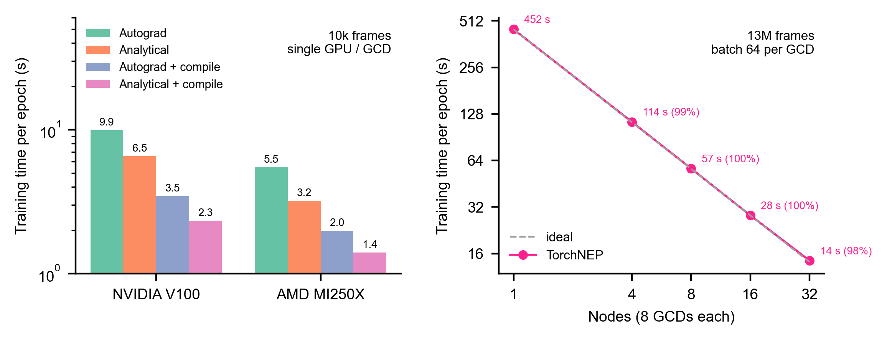

<div class="tn-hero" markdown>

{ .tn-hero__mark }
{ .tn-hero__mark }

# Train NEP potentials in PyTorch

TorchNEP is a pure PyTorch implementation of the [NEP4](https://gpumd.org/theory/nep.html) (neuroevolution potential) training framework. Trained models are written as GPUMD `nep.txt` files and run directly in GPUMD, in LAMMPS through NEP_CPU, and in ASE.
{ .tn-lead }

<p markdown>
[Get started](getting-started/installation.md){ .md-button .md-button--primary }
[View on GitHub](https://github.com/mushroomfire/torchnep){ .md-button }
</p>

</div>

```bash
pip install torchnep
```

```python
from torchnep import train_nep

train_nep("nep.in", "train.xyz", output_dir="output")
```

<div class="tn-features" markdown>

<div markdown>
**GPUMD-compatible**

`nep.txt` files load directly into GPUMD for molecular dynamics.
</div>

<div markdown>
**Two-stage training**

A force-focused first stage, then an energy-focused second stage.
</div>

<div markdown>
**Multi-GPU and multi-node**

Data-parallel training with near-linear scaling across nodes.
</div>

<div markdown>
**Fast on NVIDIA and AMD**

`torch.compile` with automatic backend selection, tuned on CUDA and ROCm.
</div>

<div markdown>
**Memory-friendly**

The dataset stays in host memory; GPU memory scales with the batch, not the dataset.
</div>

<div markdown>
**Fine-tuning**

Start from any `nep.txt` or checkpoint, optionally slimmed to the elements of the new data.
</div>

<div markdown>
**ZBL**

Universal or per-element-pair (GPUMD `zbl.in`) short-range repulsion.
</div>

<div markdown>
**Plots**

Loss curves, parity plots and error breakdowns straight from the output files.
</div>

</div>

<figure markdown>

<figcaption>Single-GPU training speed (left) and multi-node parallel scaling (right).</figcaption>
</figure>

Ready-to-use examples — the training inputs and trained models of the TorchNEP paper — are in [TorchNEP_models](https://github.com/mushroomfire/TorchNEP_models). If TorchNEP helps your research, please [cite the paper](citation.md).
